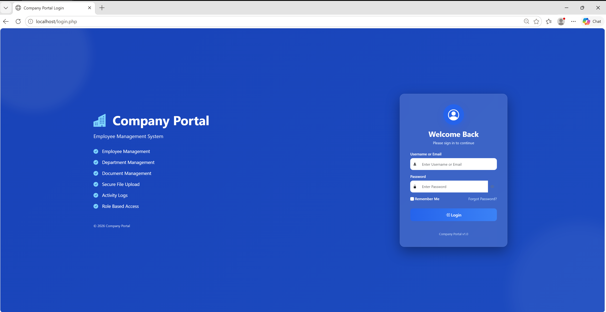
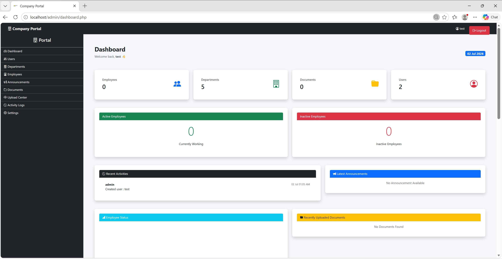
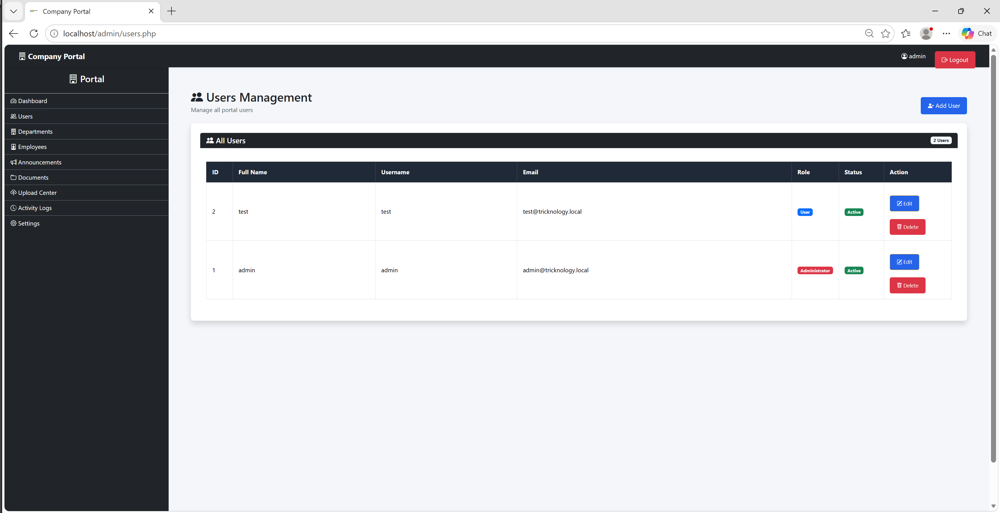
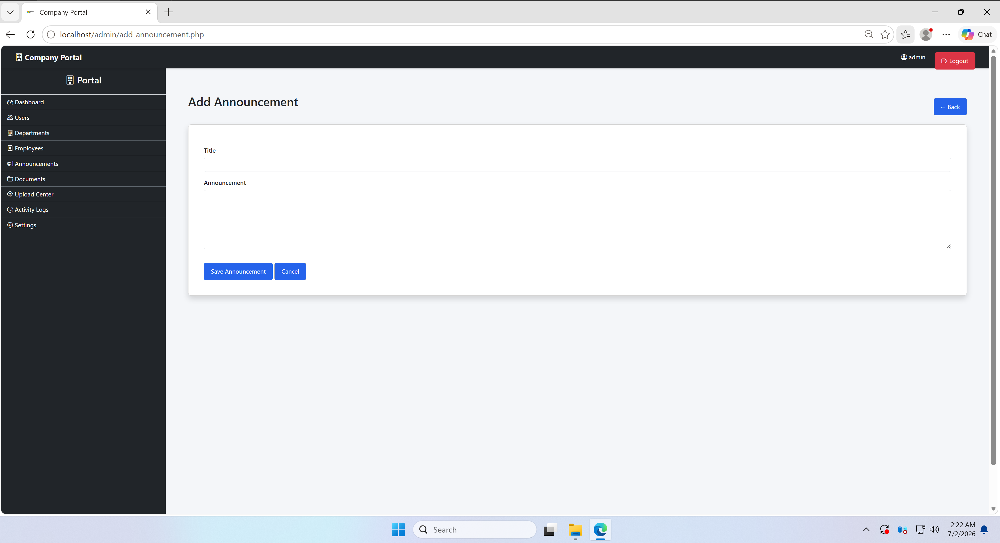
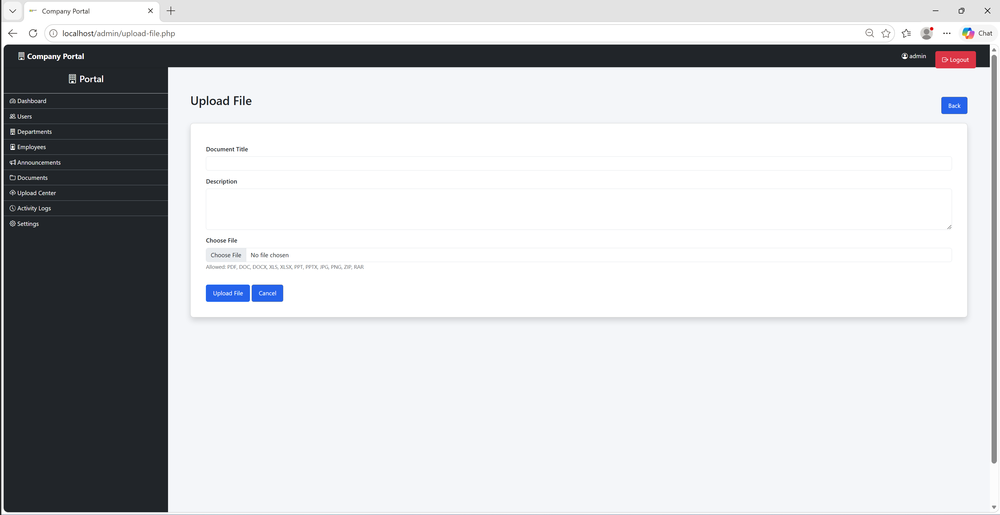
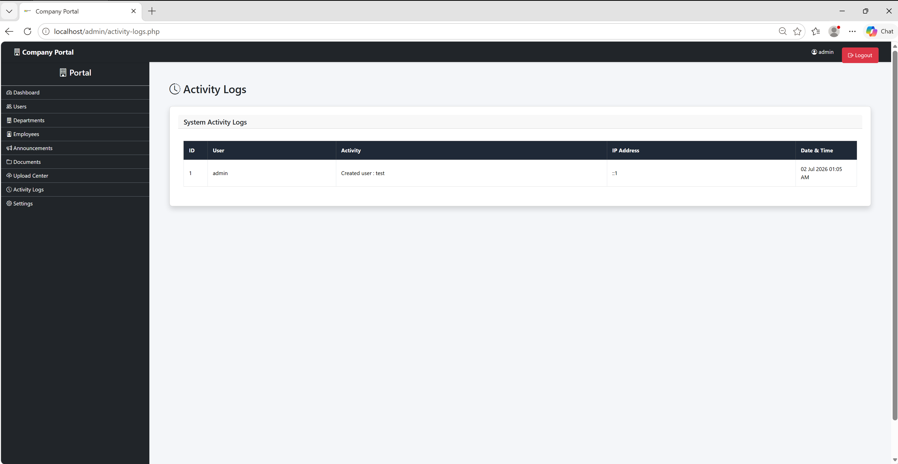
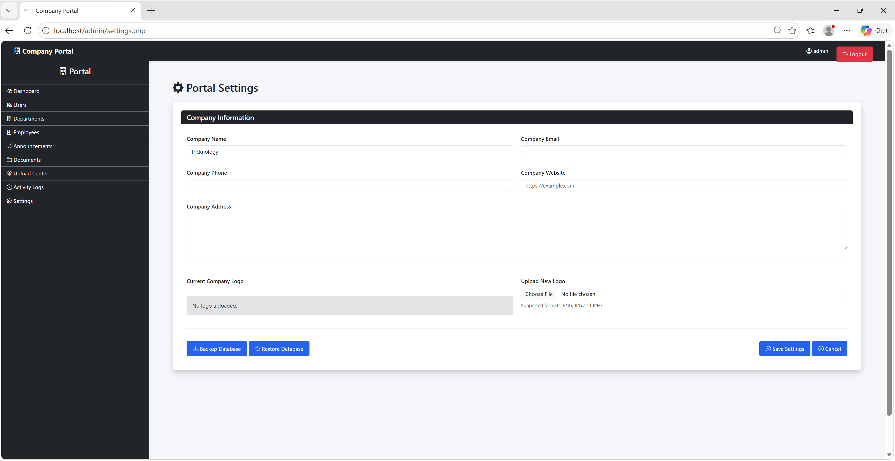
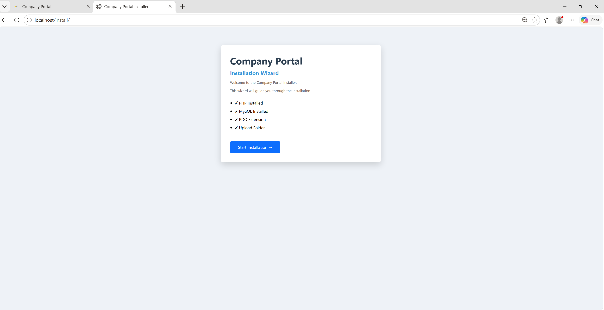

**# Company Portal**

  

**Modern Company Portal built using**

**✔ PHP 8**

**✔ MySQL 8**

**✔ Bootstrap 5**

**✔ PDO**

**✔ Installer**

**✔ Responsive Dashboard**

**---**

**## Features**

**✅ Easy Web Installer**

**✅ User Management**

**✅ Employee Management**

**✅ Department Management**

**✅ Company Documents**

**✅ Upload Center**

**✅ Announcements**

**✅ Activity Logs**

**✅ Company Settings**

**✅ Backup \& Restore Database**

**✅ Responsive Admin Dashboard**

**---**

**## Requirements**

**PHP 8+**

**MySQL 8+**

**Apache / IIS**

**PDO Extension**

**---**

**## Installation**

**1. Copy the project to your web server.**

**2. Open:**

**http://localhost/install**

**3. Complete the installer.**

**4. Login using the admin account created during installation.**

**---**

**## Screenshots**

# Screenshots

## Login

---

## Dashboard

---

## Users

---

## Announcements

---

## Upload Center

---

## Activity Logs

---

## Settings

---

## Installer

**---**

**## License**

**MIT License**

**---**

**Developed by Tricknology**

